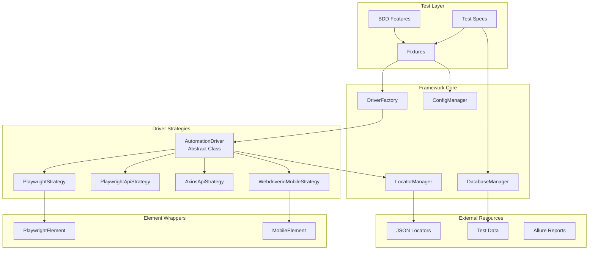
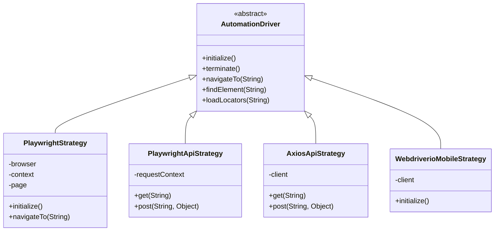
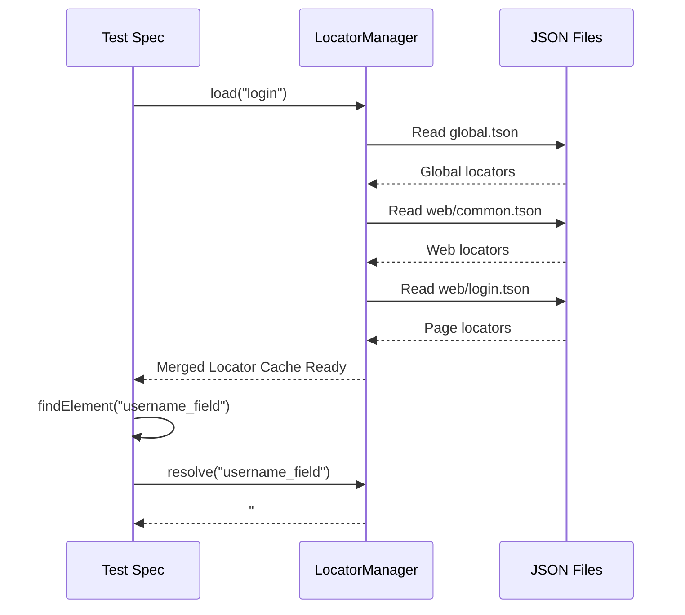
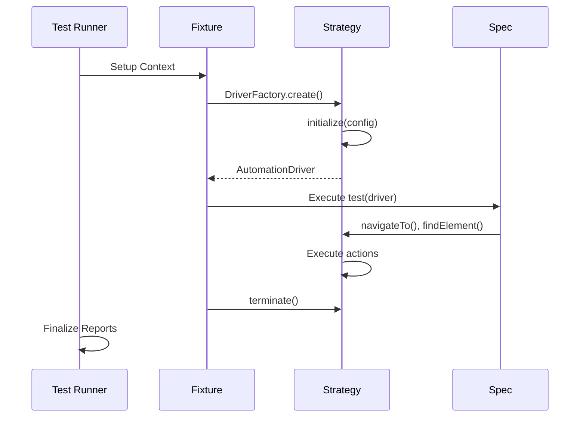

# Architecture Overview

TAFLEX JS is built on a robust, extensible architecture that follows enterprise-grade design patterns. This document explains the architectural decisions and how different components interact.

## Design Philosophy

TAFLEX JS follows these core principles:

| Principle | Description |
|-----------|-------------|
| **🧩 Strategy Pattern** | Runtime driver resolution allows the same test code to run on Web, API, or Mobile without modification. |
| **📄 Separation of Concerns** | Test logic is completely decoupled from driver implementation and locator definitions. |
| **⚙️ Configuration Over Code** | Behavior is controlled through external configuration, not hardcoded values. |
| **🧪 Fast Feedback Loop** | High-performance execution using Playwright and Vitest for rapid development. |

## High-Level Architecture



## Component Breakdown

### 1. Driver Layer

The Driver Layer implements the **Strategy Pattern**, allowing runtime selection of the appropriate driver implementation.



**Key Benefits:**
- ✅ Single test codebase for all platforms.
- ✅ Driver changes (e.g., swapping engines) don't affect test specs.
- ✅ Supports parallel execution with different strategies.

### 2. Locator System

All locators are externalized in JSON files using the **LocatorManager**.



**Locator Loading Order:**

1. `global.tson` - Common across all modes.
2. `{mode}/common.tson` - Mode-specific common locators.
3. `{mode}/{page}.tson` - Page/feature-specific locators.

### 3. Configuration Management

The **ConfigManager** provides centralized access to validated environment variables:

```javascript
import { configManager } from './config/config.manager.ts';

// Type-safe access with Zod validation
const browser = configManager.get('BROWSER');
const timeout = configManager.get('TIMEOUT');
```

### 4. Test Execution Flow



## Technology Stack

| Category | Technologies |
|----------|-------------|
| **Core Framework** | Node.ts (ESM), Zod, Dotenv |
| **Web Testing** | Playwright, Chromium/Firefox/WebKit |
| **BDD Testing** | Gherkin, playwright-bdd |
| **API Testing** | Playwright (Hybrid) · Axios (Specialized) |
| **Mobile Testing** | WebdriverIO, Appium |
| **Unit Testing** | Vitest |
| **Database** | pg (Postgres), mysql2 (MySQL) |
| **Reporting** | Allure, Playwright HTML |

## Extensibility Points

TAFLEX JS is designed for extension at multiple levels:

### 1. Custom Driver Strategies
Simply extend the `AutomationDriver` base class and register it in the `DriverFactory`.

### 2. Custom Element Wrappers
Extend or create new element wrappers to support unique platform interactions while maintaining a consistent API.

### 3. Fixtures
Customize Playwright fixtures in `tests/fixtures.ts` to inject global setup/teardown logic or custom dependencies.
